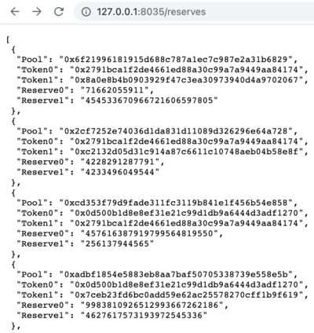

## Polygon-pools

Getting pools implemented on Uniswap Protocol V2. Updating the reserves on pools in real time.

### Features

* Using API polygonscan to get all pools on Uniswap Protocol V2, using events logs and cache
* Getting reserves for all pools using RPC, eth_call and contract override runtime code
* Updating reserves with multiple RPC subscribers, using custom sync map (on generics) and channels

### Docker quick start
```shell
docker run --rm --name polygon-pools -p 8035:8035 -it $(docker build -q .)
```

After loading the pools and reserves, the endpoint will be available `127.0.0.1:8035/reserves`

